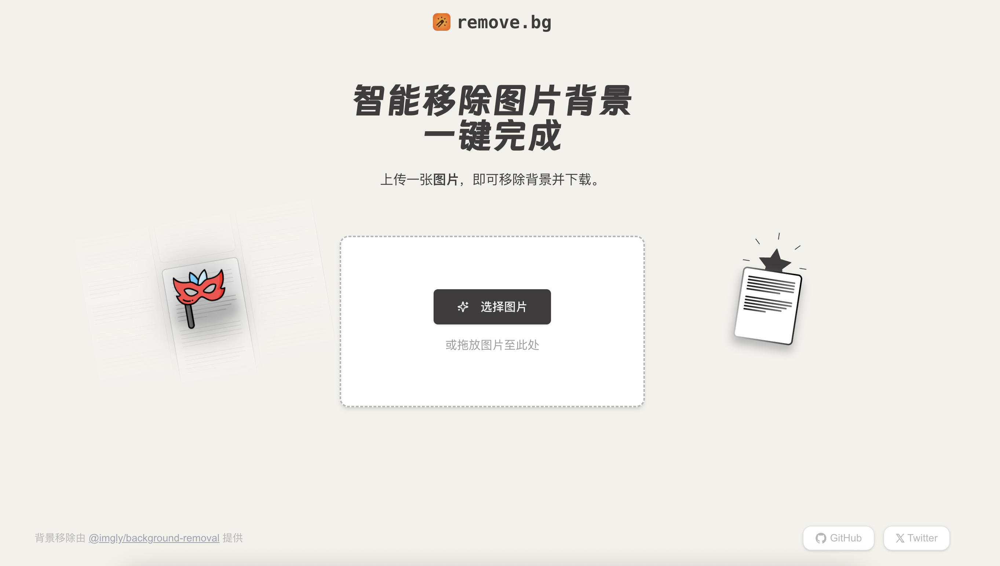

# remove-bg

remove-bg 是一款AI赋能的现代化Web应用，基于 Next.js 构建，致力于提供极致简单、快速精准的在线图片背景移除服务。

## 📸 预览



预览地址: [待部署后添加]

## ✨ 核心功能

- 🚀 **一键操作**：上传图片即可自动移除背景，简单高效。
- 🖼️ **效果对比**：提供处理前后图片对比，直观查看效果。
- 💾 **轻松下载**：方便下载处理后的无背景图片。
- 📱 **响应式设计**：适配桌面和移动设备，随时随地使用。

## 🛠️ 技术栈

- **框架**: Next.js 15.3 (App Router)
- **开发语言**: TypeScript
- **样式**: Tailwind CSS
- **核心处理**: @imgly/background-removal
- **交互**:
  - react-compare-slider
  - react-dropzone

## 🚀 快速开始

1. 克隆仓库：

```bash
git clone https://github.com/hellokaton/remove-bg.git
```

2. 安装依赖：

```bash
pnpm install
```

3. 启动开发服务器：

```bash
pnpm dev
```

## 💡 使用指南

1. 点击或拖拽上传您的图片。
2. 等待应用自动处理图片背景。
3. 在对比视图中查看移除背景后的效果。
4. 点击下载按钮保存处理后的图片。

## 🤝 贡献指南

欢迎贡献！请随时提交 Pull Request。

## 📝 许可证

[MIT](LICENSE)
